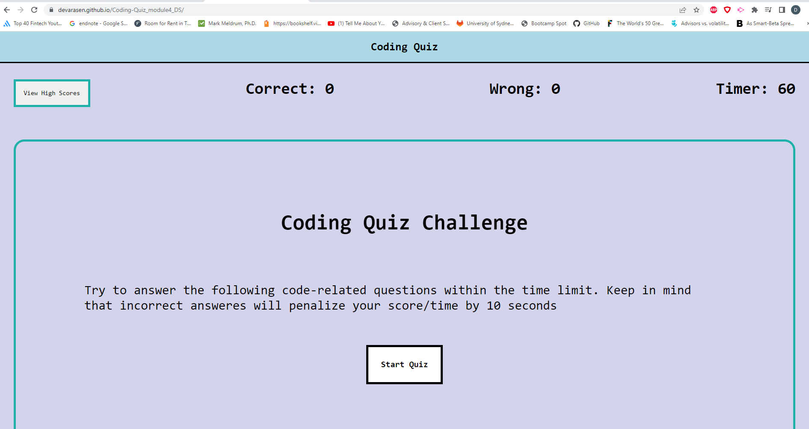
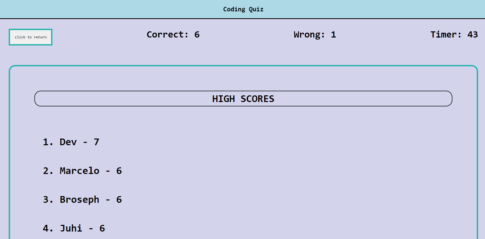

# Coding Quiz

## Description

This coding quiz will ask the user 7 questions within the time limit of 60 seconds. 
Users scores will then be logged and stored in the high scores list.

Deployed URL: https://devarasen.github.io/Coding-Quiz_module4_DS/

Repo URL: https://github.com/Devarasen/Coding-Quiz_module4_DS

## Usage

Follow instructions:

a. Click start quiz button and questions will be rendered.

b. Answer question and the next question will be presented. A total of 8 questions will be presented.

c. Answer all questions within the time limit of 60 seconds. 10 seconds will be deducted from the timer for every wrong answer.

d. At the end of the quiz, you will be given the option to save your high score.

e. You can review the high score from the main page.

## Credits

Speacial thanks to my tutors

## License

MIT license
